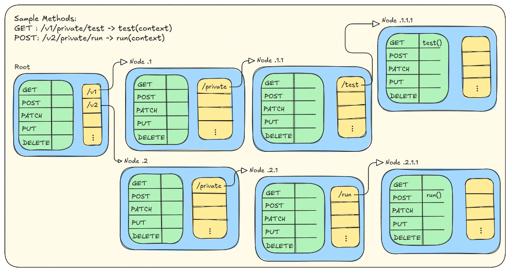

# *Gyper* - An HTTP server in Golang  

> Yes, this a re-invention of the wheel.

A project to study the internal working of an HTTP server. 

## Base Designs:

#### Worker pool design:

### Milestones:
##### 18/Jan/2025:
>   Implemeted tcp-server that accepts connections.
##### 19/Jan/2025:
>   Implemented the worker pool.
##### 16/Feb/2025:
> Implemented the tree to handle handlerFunctions.
>
> 